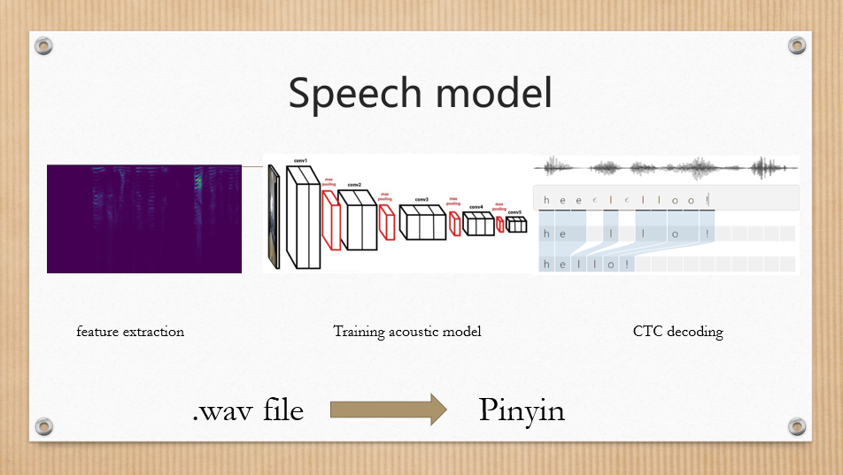
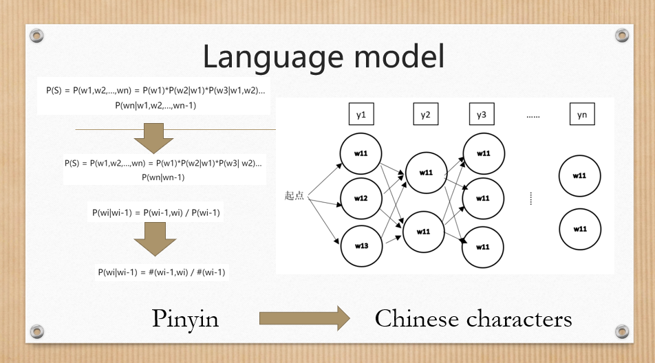
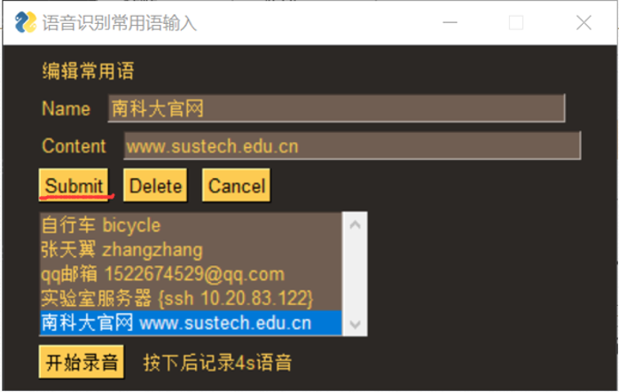
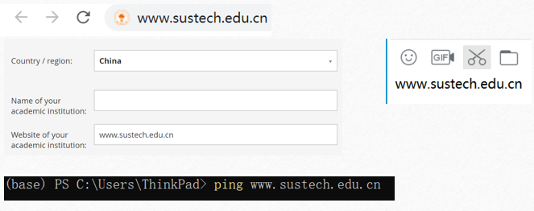
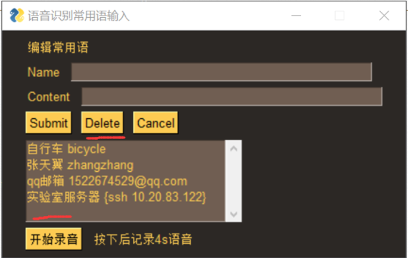

# A-smarter-Siri

This work is done in 2019 autumn CS303 Artificial Intelligence group project @ SUSTech

We developed a smarted Siri -- Commonly used text Input based on speech recognition

## Model
### Speech Model
VGG(CNN) + CTC
> Use it to convert from .wav file to Pinyin
> 
### Language Model
Hidden Markov Model with Maximum Entropy Based on Probability Graph
> Use it to convert from Pinyin to Chinese character
> 

## Experiment Setting
### Software
> Keras + Tensorflow
### Hardware
> GTX 1080 Ti 8G
### Dataset
[THCHS30 Tsinghua mandarin corpus](http://cn-mirror.openslr.org/resources/18/data_thchs30.tgz))

[Free ST Chinese Mandarin Corpus](http://cn-mirror.openslr.org/resources/38/ST-CMDS-20170001_1-OS.tar.gz)

## Our application
### 1. Input tags and triggered events

### 2. Do the sound recording

### 3. Use it in any text box

### 4. Delete when not use it


## How to run it
1. Clone this repository in your PC
2. Open one terminal
```
cd server
python asrserver.py
```
3. Open another terminal
```
cd client
client.py
```
## Features of our application
### Fast and good perfprmance garanteed
### User friendly 
> User Defined Matching

> Application Scalability

> Local Database

## The core innovation point of our application
Use speech recognition to find output a MATCHING between user-defined label and text output
> How to use it…….  Depends on your imagination!!

## Reference Github
[A Deep-Learning-Based Chinese Speech Recognition System](https://github.com/nl8590687/ASRT_SpeechRecognition)